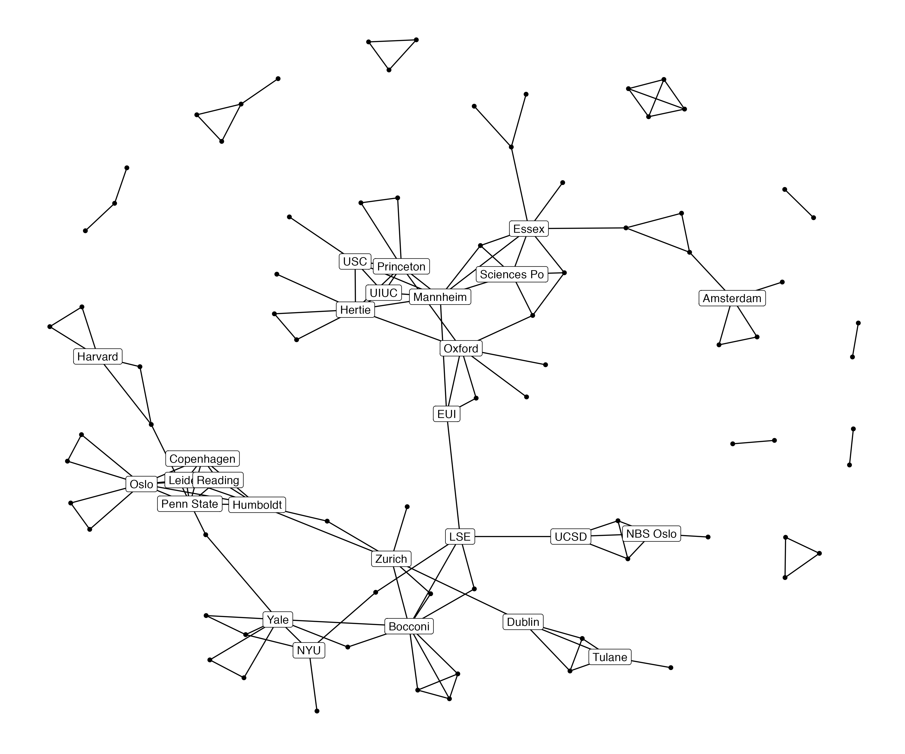
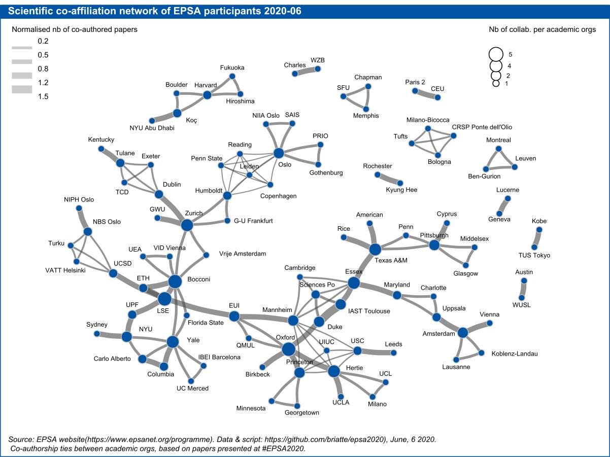

A graph of co-authorship ties between academic organizations, based on papers to be presented at the [European Political Science Association](https://www.epsanet.org/) (EPSA) 2020 conference. The conference, which has been running every year since 2011, had to go remote due to the COVID-19 pandemic, so ties might not be representative of what was originally planned.

In what follows, nodes are academic organizations, almost all of which being American or West European universities. Ties exist between nodes *i* and *j* when at least two academics from organizations *i* and *j* have coauthored a paper being presented at EPSA Virtual 2020. Isolated nodes (organizations represented only through single-authored papers) are not shown. 

# Unweighted graph

Labelling only nodes with a degree of 4+.

# Weighted graph

Using the [`cartography`](https://cran.r-project.org/package=cartography) package for many of the non-graph elements.

# Credits

Thanks to Stefan Müller for the [URLs](https://twitter.com/ste_mueller/status/1272874116333346816) to get all abstracts.
